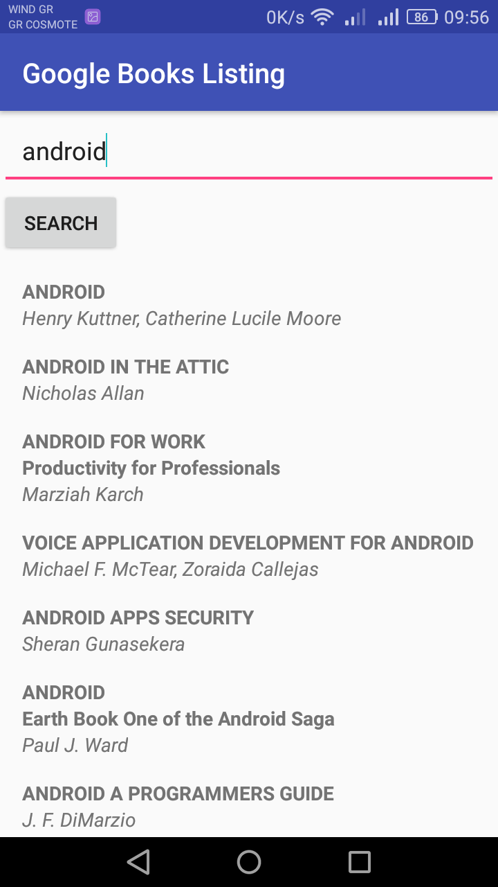

# BookListingApp
Book Listing App lets a user to enter a keyword, press the search button
and receive a list of published books which relate to that keyword, 
from the Google Books API.

This is a project during udacity's nanodegree program courses.

<h2>App's screenshots</h2>

